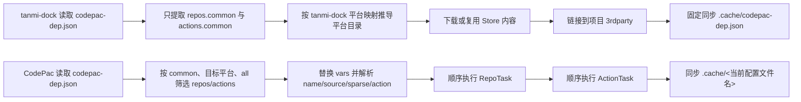
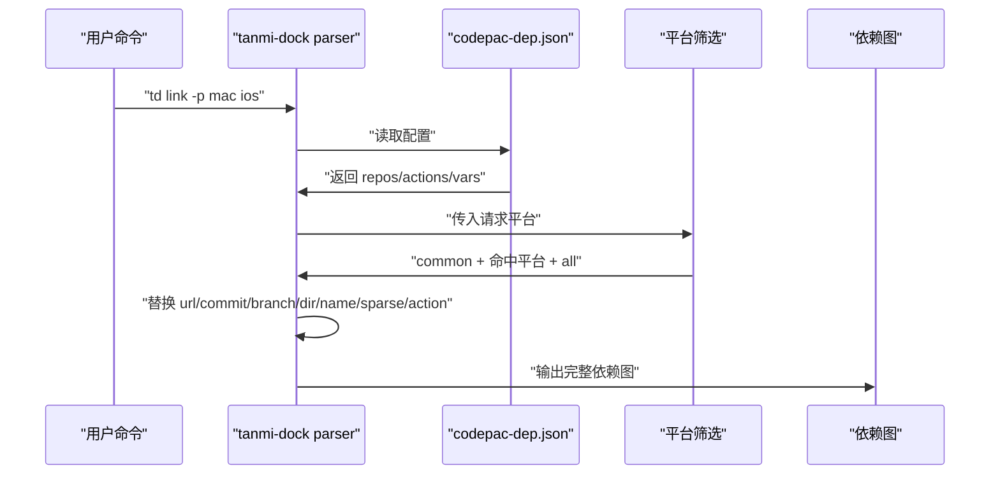
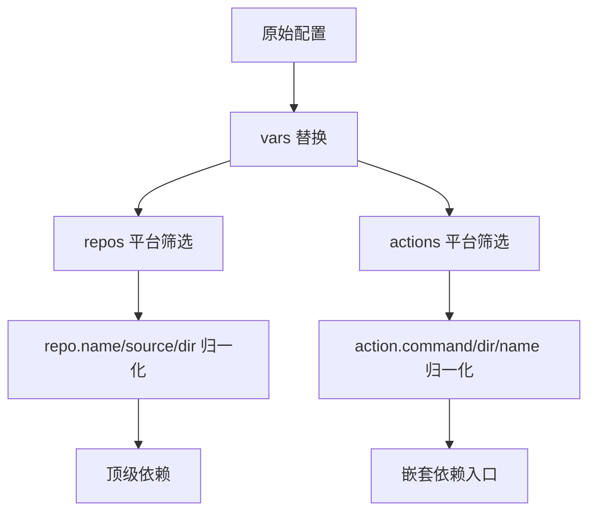
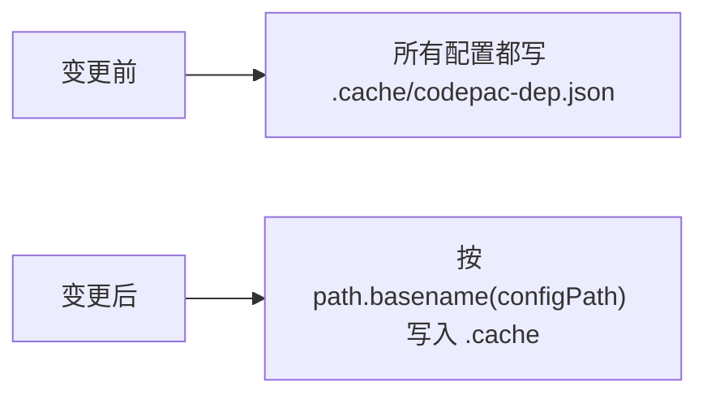
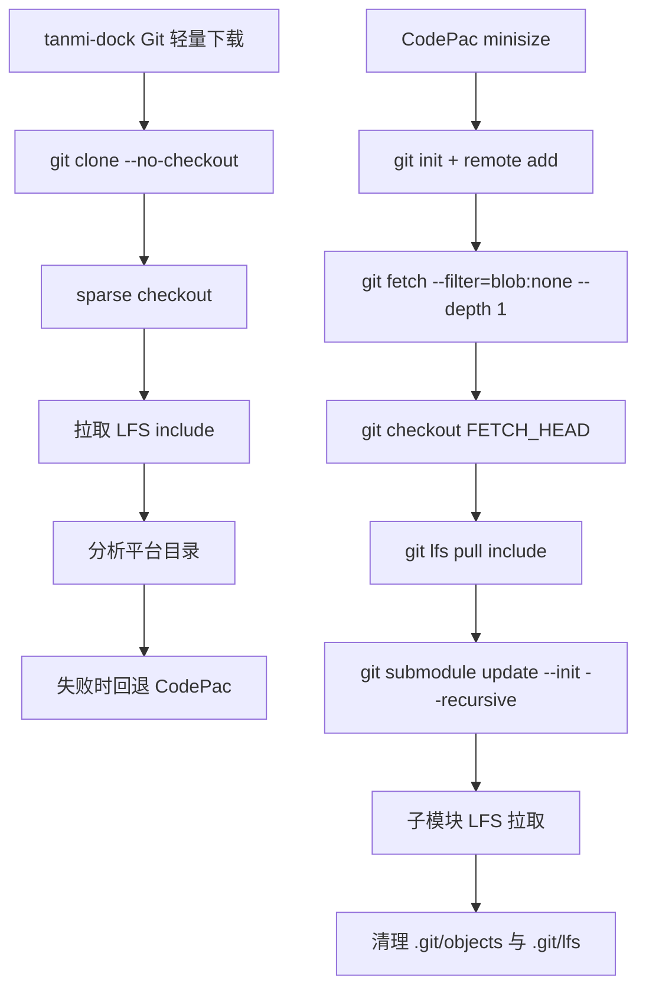
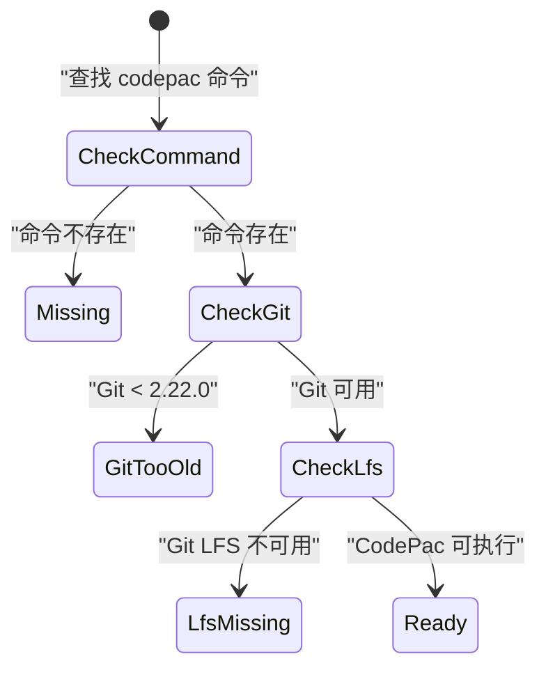
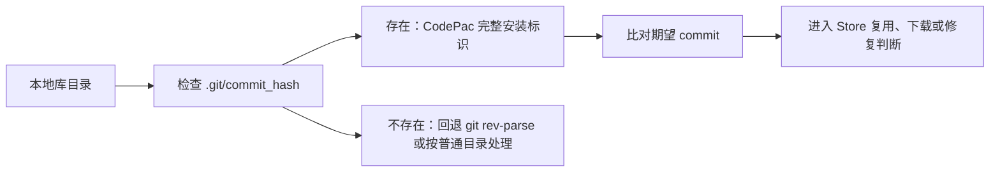
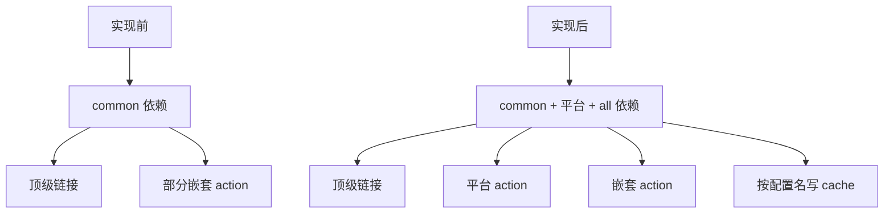

# CodePac 源码适配计划流转核查

## 一、当前差异总览

本次核查对象是 tanmi-dock 基于 CodePac 源码进行适配优化的计划。现有实现已经能调用 CodePac 并处理 Store、链接、平台筛选和嵌套依赖，但部分行为仍来自历史推测。现在有 CodePac 源码后，需要把这些推测改为源码依据。

现有流程的核心差异如下：



计划执行前，tanmi-dock 的主要职责是把 CodePac 配置转成自己的依赖图，再进入 Store 生命周期。计划执行后，配置解析、action 递归、缓存同步和下载校验需要更接近 CodePac 的真实行为，同时保留 Store 和符号链接管理能力。

**警告：当前 `repos.common` 简化模型与 CodePac 源码中的平台分组模型存在明显差异。** 如果真实配置包含 `repos.mac`、`repos.ios`、`repos.all` 或平台 action，当前依赖图会漏掉部分依赖。

计划调整后的输入和输出边界应保持清晰：输入仍是用户命令、项目路径、请求平台和 CodePac 配置文件；中间产物变为按 CodePac 规则生成的完整依赖图；最终输出仍是 Store 内容、项目符号链接、注册记录、缓存文件和状态展示。

## 二、配置解析与平台筛选

CodePac 的配置输入不是单一的 `repos.common`，而是按平台分组的对象。真实解析链路包含输入来源、变量替换、平台筛选、字段补全和重复检查。



计划需要调整的模块职责：

- `src/core/parser.ts`：从“读取固定 common 数组”调整为“按 CodePac 平台规则输出依赖和 action”。
- `src/types/index.ts`：补齐 `vars`、平台分组、repo `name`、repo `source`、action `name`、action `dir` 的结构表达。
- `src/core/platform.ts`：继续保留平台目录映射，同时为 CodePac 风格平台分组提供筛选函数。
- `src/commands/link.ts`、`src/commands/status.ts`、`src/commands/reset.ts`：读取依赖图时使用同一解析入口，减少各命令对 action 和嵌套依赖的重复理解。

数据变化如下：



**警告：变量替换范围必须覆盖 repo 字段和 action 字段。** 当前主要处理 sparse 变量，如果 `url`、`commit`、`branch`、`dir`、`name` 中出现 `${VAR}`，后续 Store 路径、下载地址和状态判断都会不准确。

**警告：`name`、`source`、`dir` 会共同影响依赖身份。** CodePac 的规则是优先使用 `name`，其次使用 `source.dir`，最后使用 `dir`。tanmi-dock 如果继续只用 `dir` 作为库名，会影响指定仓库安装、重复检测、状态展示和更新写回。

## 三、Action 递归与缓存同步

CodePac 的 action 执行不是独立命令拼接，而是父 Program 的一部分。它会继承父级平台和部分 Git 选项，并把相对路径按父配置目录和父目标目录重新计算。

```mermaid
sequenceDiagram
    participant Link as "td link"
    participant Parser as "action parser"
    participant Nested as "嵌套配置"
    participant Store as "Store"
    participant Cache as ".cache"

    Link->>Parser: "解析 actions"
    Parser->>Parser: "解析 codepac install 参数"
    Parser->>Parser: "继承平台、fullgit、unshallow、disable_sparse"
    Parser->>Parser: "按 action.name 判断 skip_action"
    Parser->>Nested: "按父 configDir 解析 --configdir"
    Parser->>Nested: "按父 targetDir 解析 --targetdir"
    Nested->>Store: "嵌套依赖进入同一 Store 生命周期"
    Store->>Cache: "写入 .cache/<配置文件名>"
```

计划执行前，`syncCacheFile` 固定写 `.cache/codepac-dep.json`。计划执行后，需要按当前配置文件名写入，例如：

- 主配置：`codepac-dep.json` 写到 `.cache/codepac-dep.json`
- 可选配置：`codepac-dep-inner.json` 写到 `.cache/codepac-dep-inner.json`
- 嵌套配置：以嵌套配置自身文件名写入对应 `.cache`



**警告：缓存文件名偏差已经有源码依据。** CodePac 在 `DepsTask` 中写 `.cache/<this.program.configFileName>`，当前固定文件名会影响多配置文件和嵌套配置的检测结果。

**警告：action 递归不是普通命令解析。** CodePac 子 action 会继承父级平台、`fullgit`、`unshallow`、`disable_sparse`。如果实现只解析 `codepac install` 的显式参数，就会漏掉跨层参数传递。

**警告：action 子流程的失败不能只看 CodePac 父命令退出码。** CodePac 源码中子 action 的退出码没有可靠向父级传播。tanmi-dock 的验证应检查嵌套目标目录、请求平台目录、`.git/commit_hash`、`.cache` 和 LFS 指针状态。

## 四、Git 轻量下载与 minisize 行为

tanmi-dock 的 Git 轻量下载是项目自有能力，目标是减少大型二进制仓库占用。CodePac 源码显示，它默认也启用 minisize 模式，但流程细节不同。



计划执行后，`src/core/codepac.ts` 的轻量下载应以 CodePac `RepoTask` 为参照补齐三类行为：

- 子模块：执行递归 submodule 更新，并识别子模块 LFS include。
- sparse 规范化：过滤空值、绝对路径、`..`、以 `-` 开头和危险字符。
- Git 载荷处理：下载完成后确认 `.git/objects` 与 `.git/lfs` 不把临时下载目录撑大。

**警告：Git 轻量下载不能只比较主仓库内容。** CodePac minisize 包含子模块初始化、子模块 LFS 拉取和子模块 Git 载荷清理。验证如果只检查主仓库平台目录，可能出现主仓库成功但真实依赖内容缺失。

**警告：关闭 `gitLightweightDownload` 不等于获得完整 Git 仓库。** CodePac 默认下载本身也是 minisize，只有传入 `--fullgit` 或 `--unshallow` 才会保留完整 Git 数据。配置项命名和用户提示需要避免让用户误解。

## 五、环境检测与状态校验

CodePac 的 `--version` 在输出版本前会先检查 Git 版本和 Git LFS。因此，`codepac --version` 失败不一定代表 CodePac 没安装，也可能是 Git 版本不足、Git LFS 缺失或 root 运行限制。



计划执行后，`src/core/codepac.ts` 和 `src/commands/check.ts` 可以从布尔值升级为结构化结果：

- CodePac 命令是否存在
- Git 版本是否满足 CodePac 要求
- Git LFS 是否可用
- CodePac 版本命令是否能执行
- 失败时的外部返回信息

状态校验也应补入 CodePac 的真实管理标识：



**警告：只检查 `.git` 目录不足以判断 CodePac 安装完整。** CodePac 使用 `.git/commit_hash` 判断安装是否完成，tanmi-dock 的校验逻辑应把该文件作为重要输入。

## 六、实施风险与验证重点

计划带来的结构性变化集中在解析入口和依赖图生成。实现后，`link`、`status`、`reset`、`unavailable` 等命令读取到的依赖集合可能变多，因为平台专属 repos/actions 会被纳入。



第六章不再扩大行为范围，只做发布前一致性与验证清单整理。已经实施的五类行为分别由以下自动化验证支撑：

| 验证链路 | 覆盖内容 | 主要测试文件 |
|----------|----------|--------------|
| 配置解析 | `repos/actions` 平台分组、`all`、`vars` 替换、`name/source/dir` 身份规则、重复 `dir/name` 检测 | `tests/core/parser.test.ts` |
| 多配置与缓存 | 主配置、可选配置、嵌套 action 配置分别同步 `.cache/<配置文件名>` | `tests/integration/multi-config.test.ts` |
| action 递归 | 相对 `--configdir`、相对 `--targetdir`、平台继承、`--skip-action`、非 `codepac install` action 跳过 | `tests/integration/tc017-link-command.test.ts`、`tests/integration/tc019-status-command.test.ts`、`tests/integration/tc026-unavailable-command.test.ts` |
| Git minisize | Git 非完整拉取成功后写 `commit_message` 和 `commit_hash`、清理 `.git/objects` 与 `.git/lfs`、递归处理 submodule Git 载荷、失败回退 CodePac | `tests/core/codepac.test.ts` |
| 环境状态 | CodePac 命令、Git 版本、Git LFS、`codepac --version`、`.git/commit_hash` 读取 | `tests/commands/check-environment.test.ts`、`tests/utils/git.test.ts` |
| Store 完整性 | 文件数量、大小、内容哈希、损坏 Store 修复、旧元数据回填 | `tests/commands/check-integrity.test.ts`、`tests/core/store.test.ts` |

仍需保留为发布前重点复测的缺口：

- `td reset` 对可选配置、嵌套 action 和 submodule 配置的命令级覆盖少于 `link/status/unavailable`，发布前需要人工用真实项目复测单库重置和全局重置。
- 日志断言主要依赖人工观察，后续如果继续强化第六章，可以增加对 action 路径、缓存写入、环境检测失败原因的最小日志断言。
- `td unavailable list` 的输出可见性测试少于 add/remove，发布前需要人工确认列表能展示嵌套依赖和手动平台缺失规则。
- Git 非完整拉取和 CodePac fallback 已有单测覆盖，真实大型 LFS 与 submodule 仓库仍需要保留一轮手工复测。

发布保护清单：

- 保留 `gitLightweightDownload` 配置项、默认值、配置命令入口、README、CHANGELOG、测试和 `1.1.0` 到 `1.2.0` 的配置迁移。
- 保持 `package.json`、`package-lock.json` 的软件包版本不变。
- 保持 `CURRENT_CONFIG_VERSION`、`MIN_SUPPORTED_VERSION`、配置迁移函数不变。
- 不因对齐 CodePac 默认 minisize 行为而删除 TanmiDock 的 Git 非完整拉取入口。
- 第六章只同步 README、CLI、CHANGELOG 与本计划文档，不修改下载、Store、clean、reset 的实际行为。

日志也需要随实现补齐。关键日志应覆盖配置文件路径、请求平台、平台筛选结果、变量替换结果、依赖身份生成、action 继承参数、嵌套配置路径、缓存写入路径、下载方式、外部命令返回、异常分支和最终链接结果。复测时应能仅凭日志判断断点位于解析、递归、下载、缓存、状态校验中的哪一段。

**警告：解析入口改动会扩大多个命令的行为范围。** 计划实施时需要同步更新测试，覆盖 `link`、`status`、`reset`、`unavailable` 和多配置文件场景，避免某个命令仍使用旧的 common-only 视图。

**警告：这不是一次局部修补。** 如果只改 `.cache` 或只改 parser，嵌套 action、状态展示和 Store 注册仍可能看到不同依赖集合。更合理的执行方式是先建立统一解析入口，再让各命令逐步迁移到同一入口。
